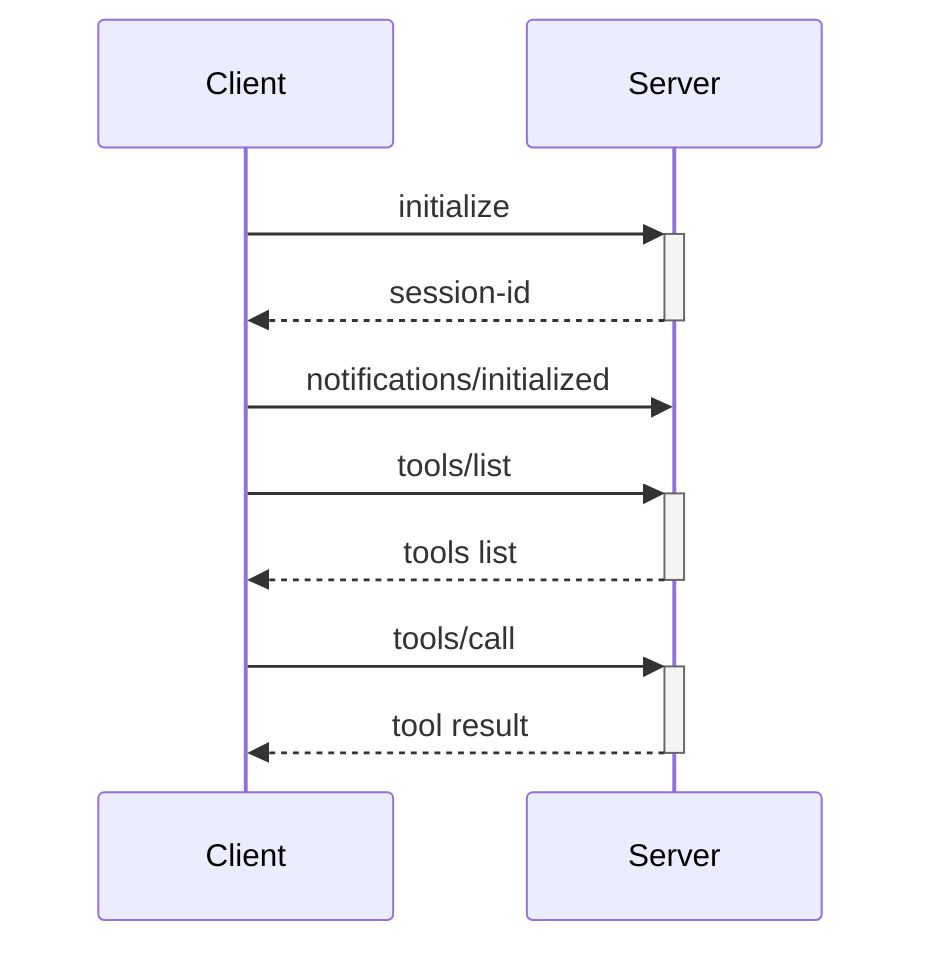

# MCP Server StreamHTTP - Curl Testing

A test client for Model Context Protocol (MCP) servers using HTTP streaming transport. This project is specifically designed for testing curl interactions with MCP streamable HTTP servers.

## Overview

This project provides a bash script to test MCP server implementations that use HTTP streaming as their transport layer. It demonstrates the complete MCP protocol handshake and tool invocation flow using curl.

## Repository

This test setup works with the MCP Rust SDK examples from:
https://github.com/modelcontextprotocol/rust-sdk

## Building the Examples

To build the streamable HTTP counter server example:

```bash
cargo build --example servers_counter_streamhttp --package mcp-server-examples
```

To build the streamable HTTP client example:

```bash
cargo build --example clients_streamable_http --package mcp-client-examples
```

## Features

- **MCP Protocol Support**: Implements the MCP 2025-03-26 protocol version
- **Session Management**: Handles session-based communication using `Mcp-Session-Id` headers
- **HTTP Streaming**: Uses `text/event-stream` for real-time communication
- **JSON-RPC 2.0**: Follows the JSON-RPC 2.0 specification for message formatting

## Prerequisites

- `bash`
- `curl`
- `yq` (for JSON processing)
- An MCP server running on `http://127.0.0.1:8000/mcp`

## Usage

Run the test script:

```bash
./test.sh
```

## What the Test Script Does

The script performs the following MCP protocol operations:

### 1. Initialize Connection
Sends an `initialize` request to establish a connection with the MCP server:
- Sets protocol version to `2025-03-26`
- Identifies client as `curl-test v1.0.0`
- Captures the session ID from response headers

### 2. Send Initialized Notification
Notifies the server that initialization is complete using the `notifications/initialized` method.

### 3. List Available Tools
Requests the list of available tools from the server using `tools/list`:
- Saves the response to `tools.json`
- Uses `yq` to format the output

### 4. Call a Tool
Invokes the `get_value` tool as a demonstration of tool execution.

## Output Files

- **headers.txt**: Contains HTTP response headers from the initialize request
- **tools.json**: Contains the formatted list of available tools from the server

## MCP Protocol Flow



## Sample run

```
./test.sh
{
  "jsonrpc": "2.0",
  "id": 1,
  "result": {
    "protocolVersion": "2024-11-05",
    "capabilities": {
      "prompts": {},
      "resources": {},
      "tools": {}
    },
    "serverInfo": {
      "name": "rmcp",
      "version": "0.13.0"
    },
    "instructions": "This server provides counter tools and prompts. Tools: increment, decrement, get_value, say_hello, echo, sum. Prompts: example_prompt (takes a message), counter_analysis (analyzes counter state with a goal)."
  }
}
Session ID: c7007081-f2ba-44c5-a148-93f4aadadaa1
{
  "jsonrpc": "2.0",
  "id": 3,
  "result": {
    "content": [
      {
        "type": "text",
        "text": "0"
      }
    ],
    "isError": false
  }
}

```

## Configuration

To test against a different MCP server, modify the `URL` variable in `test.sh`:

```bash
URL="http://your-server:port/mcp"
```

## License

This is a test/example project for MCP server implementations.
