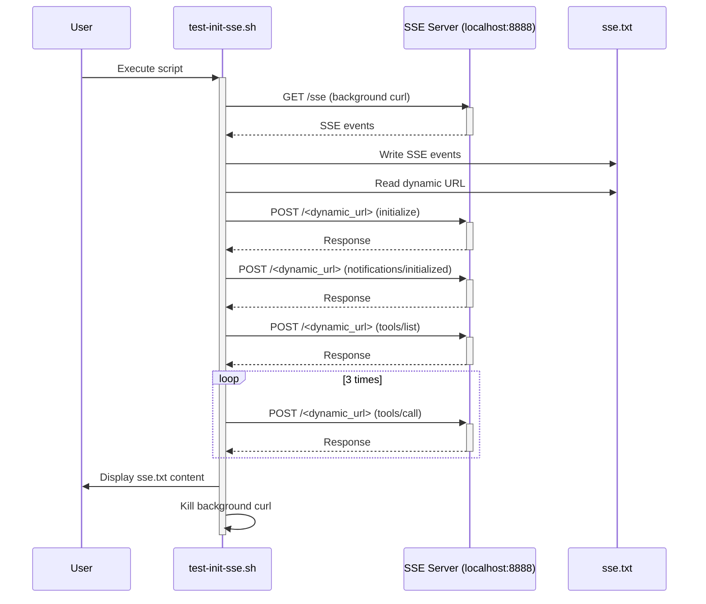

# SSE Streamable HTTP Test

This project provides a test script to verify Server-Sent Events (SSE) for a streamable HTTP connection.

## Description

The `test-init-sse.sh` script simulates a client connecting to an SSE endpoint, sending JSON-RPC messages, and receiving events. The script uses `curl` to manage the HTTP connection.

The `sse.txt` file is used to log events from the server during a test run. The version in the repository serves as a sample of the expected output.

## Usage

To run the test, execute the following command:

```bash
./test-init-sse.sh
```

**Prerequisites:**
- A server that implements the tested protocol must be running on `http://127.0.0.1:8888`.

## Execution Flow

The following diagram illustrates the execution flow of the `test-init-sse.sh` script:



## Files

- `test-init-sse.sh`: The main test script.
- `sse.txt`: A sample output file containing the SSE events.
